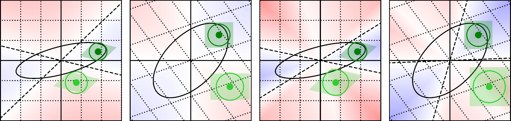

# WUSH: Near-Optimal Adaptive Transforms for LLM Quantization

[arXiv.org](https://arxiv.org/abs/2512.00956) |
[GitHub.com](https://github.com/IST-DASLab/WUSH) |
[Citation](#citation)

<p align="center">

</p>

Official repository for the preprint paper "WUSH: Near-Optimal Adaptive Transforms for LLM Quantization" by _Jiale Chen_, _Vage Egiazarian_, _Roberto L. Castro_, _Torsten Hoefler_, and _Dan Alistarh_ from the _Institute of Science and Technology Austria (ISTA)_, _Red Hat AI_, and _ETH Zürich_.

**Keywords:** LLM, Quantization, Transform

## Paper Abstract

**TL;DR:** WUSH is a closed-form, data-aware, near-optimal blockwise transform that reduces LLM quantization error.

> Quantizing LLM weights and activations is a standard approach for efficient deployment, but a few extreme outliers can stretch the dynamic range and amplify low-bit quantization errors. Prior transform-based mitigations (e.g., Hadamard rotations) are fixed and data-agnostic, and their optimality for quantization has remained unclear. We derive closed-form optimal linear blockwise transforms for joint weight-activation quantization under standard RTN AbsMax-scaled block quantizers, covering both integer and floating-point formats. The resulting construction, WUSH, combines a Hadamard backbone with a data-dependent second-moment component to form a non-orthogonal transform that is provably near-optimal for FP and INT quantizers under mild assumptions while admitting an efficient fused GPU implementation. Empirically, WUSH improves W4A4 accuracy over the strongest Hadamard-based baselines (e.g., on Llama-3.1-8B-Instruct in MXFP4, it gains +2.8 average points with RTN and +0.7 with GPTQ) while delivering up to 6.6× per-layer throughput over BF16 via FP4 MatMul. Source code is available at https:<!---->//github.com/IST-DASLab/WUSH.

Please read our full paper if you are interested in the method details.

## Environment Setup

<p>
<a href="https://www.python.org/downloads/"></a>
<a href="https://pytorch.org/get-started/"></a>
</p>

**Note:** The repository is built on the codebase from the paper [Bridging the Gap Between Promise and Performance for Microscaling FP4 Quantization](https://github.com/IST-DASLab/FP-Quant).

```bash
conda create -n wush python=3.12 ipykernel ipywidgets cmake --yes

source "$(conda info --base)/etc/profile.d/conda.sh"
conda activate wush

pip install --pre torch==2.11.0.dev20260122+cu128 --index-url https://download.pytorch.org/whl/nightly/cu128
pip install numpy pandas datasets

git clone git@github.com:vahe1994/transformers.git && cd transformers && git checkout wush_tmp && pip install -e . && cd ..

git clone git@github.com:Dao-AILab/fast-hadamard-transform
cd fast-hadamard-transform
pip install -e .
cd ..

git clone git@github.com/IST-DASLab/qutlass
cd qutlass
# Installing QuTLASS (run from the repository root that contains the submodule)
mv mma_multistage.h third_party/cutlass/include/cutlass/gemm/threadblock/
mv mma_tensor_op.h third_party/cutlass/include/cutlass/gemm/warp/

pip install --no-build-isolation .

# Installing the fp-quant linear layer with WUSH support
cd ../WUSH/inference_lib
pip install -e .
cd ../../

pip install lm_eval==0.4.9

git clone git@github.com:Vahe1994/platinum-benchmarks.git && cd platinum-benchmarks && git checkout local_evals && pip install -e .
```

## How to Run

The script to run WUSH quantization is in [scripts/wush.sh](./scripts/wush.sh).

```bash
CUDA_VISIBLE_DEVICES=0 GPTQ=1 TRANSFORM_CLASS=wush bash scripts/wush.sh
```

## Kernel Benchmarks

```bash
python qutlass/benchmarks/bench_mxfp4_sm100.py
```

## Citation

Please cite our paper if you find it useful. Thank you!

**Plain text:**

```text
Jiale Chen, Vage Egiazarian, Roberto L. Castro, Torsten Hoefler, and Dan Alistarh. Wush: Near-optimal adaptive transforms for llm quantization. arXiv preprint, 2026. URL https://arxiv.org/abs/2512.00956.
```

**BibTex:**

```bibtex
@misc{chen2026wushnearoptimaladaptivetransforms,
      title={WUSH: Near-Optimal Adaptive Transforms for LLM Quantization}, 
      author={Jiale Chen and Vage Egiazarian and Roberto L. Castro and Torsten Hoefler and Dan Alistarh},
      year={2026},
      eprint={2512.00956},
      archivePrefix={arXiv},
      primaryClass={cs.LG},
      url={https://arxiv.org/abs/2512.00956}, 
}
```
