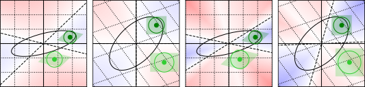

# WUSH: Near-Optimal Adaptive Transforms for LLM Quantization (ICML 2026)

[ICML.cc](https://icml.cc/virtual/2026/poster/63124) |
[OpenReview.net](https://openreview.net/forum?id=ZsECxUkbKB) |
[arXiv.org](https://arxiv.org/abs/2512.00956) |
[GitHub.com](https://github.com/IST-DASLab/WUSH) |
[Citation](#citation)

<p align="center">

</p>

Official repository for the ICML 2026 paper "WUSH: Near-Optimal Adaptive Transforms for LLM Quantization" by _Jiale Chen_, _Vage Egiazarian_, _Roberto L. Castro_, _Torsten Hoefler_, and _Dan Alistarh_ from the _Institute of Science and Technology Austria (ISTA)_, _Red Hat AI_, and _ETH Zürich_.

**Keywords:** LLM, Quantization, Transform

## Paper Abstract

**TL;DR:** WUSH is a closed-form, data-aware, near-optimal blockwise transform that reduces LLM quantization error.

> Quantizing LLM weights and activations is a standard approach for efficient deployment, but a few extreme outliers can stretch the dynamic range and amplify low-bit quantization errors. Prior transform-based mitigations (e.g., Hadamard rotations) are fixed and data-agnostic, and their optimality for quantization has remained unclear. We derive closed-form optimal linear blockwise transforms for joint weight-activation quantization under standard RTN AbsMax-scaled block quantizers, covering both integer and floating-point formats. The resulting construction, WUSH, combines a Hadamard backbone with a data-dependent second-moment component to form a non-orthogonal transform that is provably near-optimal for FP and INT quantizers under mild assumptions while admitting an efficient fused GPU implementation. Empirically, WUSH improves W4A4 accuracy over the strongest Hadamard-based baselines (e.g., on Llama-3.1-8B-Instruct in MXFP4, it gains +2.8 average points with RTN and +0.7 with GPTQ) while delivering up to 5.8× per-layer throughput over BF16 via FP4 MatMul. Source code is available at https:<!---->//github.com/IST-DASLab/WUSH.

Please read our full paper if you are interested in the research details.

## Repository Structure

The repository is organized into four components.

- [`src/`](./src) - the post-training quantization pipeline: CLI, RTN/GPTQ, block-transform math (including the WUSH transform), FP4 quantizers, and the `QuantLinear` inference module.
- [`src/triton_kernels/`](./src/triton_kernels) - portable **Triton** kernels: block transform, fused block transform + quantization, FP4 matmul, and Hessian accumulation.
- [`cuda_kernels/`](./cuda_kernels) - QuTLASS-derived **CUDA** kernels for fused block transform + quantization and FP4 matmul, with NVIDIA [CUTLASS](https://github.com/NVIDIA/cutlass) as a submodule.
- [`plots/`](./plots) - the scripts (and generated `.pdf`/`.svg`) for the paper figures.

Most of these files are generic and self-contained - each ships its own unit tests and benchmarks and is fully portable - so individual components are easy to reuse beyond WUSH.

## Environment Setup

<p>
<a href="https://www.python.org/downloads/"></a>
<a href="https://pytorch.org/get-started/"></a>
<a href="https://developer.nvidia.com/cuda-downloads"></a>
</p>

**Note:** The repository is built on the codebase from the paper [Bridging the Gap Between Promise and Performance for Microscaling FP4 Quantization](https://github.com/IST-DASLab/FP-Quant).

Below are installation instructions with `uv`.
```bash
# Clone our repository
git clone --recurse-submodules https://github.com/IST-DASLab/WUSH.git
cd WUSH

# Install Python environment
uv venv .venv --python 3.14
source .venv/bin/activate

# Install PyTorch
uv pip install torch --index-url https://download.pytorch.org/whl/cu132

# Install other dependencies
uv pip install scipy transformers datasets accelerate matplotlib pytest

# [Optional] Install QuTLASS-WUSH (CUDA kernels)
git submodule update --init --recursive  # if third-party resources are not pulled initially
uv pip install cmake ninja
uv pip install --no-build-isolation cuda_kernels/

# [Optional] Install optional dependencies
uv pip install wandb lm_eval

# [Optional] Install (modified) Platinum Benchmarks
git clone https://github.com/Vahe1994/platinum-benchmarks.git && cd platinum-benchmarks && git checkout local_evals && uv pip install -e .
```

[`requirements.txt`](./requirements.txt) records the exact tested package versions.

## Quantization Pipeline

The entry point is [`src/main.py`](./src/main.py).
Run it from the repository root with `PYTHONPATH=src` (set in the example below) so that `python -m main` resolves the package imports.
Every option is a plain command-line argument; boolean options take an explicit `1`/`0` (or `true`/`false`) value, e.g. `--gptq=1`.
Run `python -m main --help` for the full list of options and their defaults.

The command below reproduces a full MXFP4 + WUSH GPTQ run on Llama-3.2-3B-Instruct, evaluating WikiText-2 perplexity and OpenLLM v1, and exporting the quantized model.
The leading variables are process-level environment settings (the GPU selection, the CUDA allocator config, the thread count, code-eval permission, and the module search path):

```bash
CUDA_VISIBLE_DEVICES=0 \
PYTORCH_CUDA_ALLOC_CONF=max_split_size_mb:128 \
OMP_NUM_THREADS=16 \
HF_ALLOW_CODE_EVAL=1 \
PYTHONPATH=src \
python -m main \
    --model_name_or_path=meta-llama/Llama-3.2-3B-Instruct \
    --format=mxfp4 \
    --eval_openllm=1 \
    --save_path=quantized_models/Llama-3.2-3B-Instruct-mxfp4-gptq-wush
```

The model is saved with `save_pretrained`, so it reloads with `AutoModelForCausalLM.from_pretrained` (import `quant_hf` first to register the quantizer; the checkpoint's `config.json` carries `quant_method="wush"` and is otherwise self-describing).
To load a saved checkpoint and run the evaluations directly, skipping quantization, pass `--load_path=<dir>` (in place of `--model_name_or_path`/`--format`).

GPTQ (`--gptq`), the WUSH transform (`--transform_type=wush`), CPU offloading (`--cpu_offload_modules`/`--cpu_offload_activations`), WikiText-2 perplexity evaluation (`--eval_perplexity`), and seed `0` are the defaults and are omitted above; pass, e.g., `--gptq=0` (RTN), `--transform_type=h` (Hadamard), `--cpu_offload_modules=0`, or `--eval_perplexity=0` to change them.
`--eval_openllm` (which needs `lm_eval`) and `--save_path` (which exports the quantized model) are opt-in (drop them for a leaner run); add `--eval_platinumbench=1` for PlatinumBench.

This repository implements the floating-point W4A4 quantizers used in the paper's main experiments - MXFP4 (group size 32) and NVFP4 (group size 16).
The integer format that appears in the paper's theory and layer-wise analysis is not part of the released quantization pipeline.

### Source Layout

A run flows through [`src/`](./src) as follows: [`main.py`](./src/main.py) parses the arguments and loads the model, [`data_utils.py`](./src/data_utils.py) builds the calibration set, and [`quantize_model.py`](./src/quantize_model.py) walks the model block by block - capturing each block's inputs and accumulating the input Hessian; [`quantize_layer.py`](./src/quantize_layer.py) then runs RTN or GPTQ under the chosen block transform (`i` identity / `h` Hadamard / `wush`) and quantizes to FP4 via [`quantize_fp4.py`](./src/quantize_fp4.py).
Each result is packed into a `QuantLinear` module ([`quant_module.py`](./src/quant_module.py)); the model is then evaluated (perplexity / OpenLLM) and optionally exported with `save_pretrained`.

| File | Role |
| --- | --- |
| [`main.py`](./src/main.py) | CLI entry point: argument parsing, orchestration, evaluation, save/load |
| [`quantize_model.py`](./src/quantize_model.py) | Model-level orchestration: per-block Hessian capture, quantize, output propagation |
| [`quantize_layer.py`](./src/quantize_layer.py) | RTN / GPTQ algorithms + block-transform dispatch |
| [`compute_gram.py`](./src/compute_gram.py) | Gram / Hessian construction, dampening, Cholesky inversion, etc. |
| [`block_transform.py`](./src/block_transform.py) | Block transforms: identity, Hadamard, random orthogonal, and the WUSH transform |
| [`quantize_fp4.py`](./src/quantize_fp4.py) | FP4 (e2m1) group quantize / dequantize / pack |
| [`quant_module.py`](./src/quant_module.py) | `QuantLinear`: FP4 inference module with `torch`/`triton`/`cuda` backends |
| [`quant_hf.py`](./src/quant_hf.py) | Hugging Face save/load integration |
| [`data_utils.py`](./src/data_utils.py) | Calibration data loaders |
| [`evaluate_perplexity.py`](./src/evaluate_perplexity.py) | WikiText-2 perplexity evaluation |
| [`common_utils.py`](./src/common_utils.py) | Seeding and device utilities |

## GPU Kernels - CUDA & Triton

`QuantLinear.forward` performs a real FP4 matmul (not a fake-quant simulation) through three interchangeable backends; the activation quantization backend and the matmul backend are chosen independently and fall back gracefully when a kernel is unavailable:

- **`torch`** - dequantize then matmul, the always-available reference (and the fake-quant baseline).
- **`triton`** - the runtime-compiled, portable kernels in [`src/triton_kernels/`](./src/triton_kernels).
- **`cuda`** - the offline-compiled QuTLASS-derived kernels in [`cuda_kernels/`](./cuda_kernels).

The CUDA kernels target NVIDIA Blackwell (`sm100` / `sm120`) with CUDA 13.2.
The Triton kernels are verified on `sm80` (A100), `sm86` (A6000), `sm89` (L40S), `sm90` (H100), `sm100` (B200), and `sm120` (RTX 5090).
FP4 operations - the `e2m1` conversion and the block-scaled tensor-core matmul - are natively supported only on Blackwell; on earlier architectures the Triton kernels transparently emulate them, producing numerically equivalent results so the same code path stays fully portable.

| Functionality | Implementation | Format |
| --- | --- | --- |
| Block transform + quantize | CUDA | MXFP4 |
| Block transform + quantize | Triton | MXFP4 / NVFP4 |
| Block transform (shared) + quantize | CUDA / Triton | MXFP4 / NVFP4 |
| FP4 matmul | CUDA / Triton | MXFP4 / NVFP4 |
| Quantize | Triton | MXFP4 / NVFP4 |
| Block transform | Triton | FP |
| Hessian accumulation | Triton | FP |

Other QuTLASS ops ship but are not exercised by the released PTQ inference path.

The CUDA and Triton kernels ship with their own unit tests and benchmarks that you can run directly, for example:
```bash
# CUDA: fused MXFP4 kernel throughput benchmark
python cuda_kernels/tests/bench_mxfp4_sm100.py

# Triton: FP4 matmul unit tests and benchmarks
PYTHONPATH=src python -m triton_kernels.fp4mm
```

## Plotting Scripts

The `plots` folder contains the scripts used to generate the paper figures in `.pdf` and `.svg` format.
The generated files are already included in this folder.

To re-generate the figures, please run (from [`plots/`](./plots)) the commands below.
```bash
cd plots
python 1_toy_example.py     # Figure 1
python 2_speedup.py         # Figure 2
python 3_platinum_bench.py  # Figures 3, 7-10
python 4_marginals.py       # Figure 4
python 5_visual.py          # Figure 5
python 6_fp_model.py        # Figure 6
```

Notes:
- [`plot_utils.py`](./plots/plot_utils.py) is a shared helper module (imported by Figures 1, 4, and 5).
- [`5_visual.pt`](./plots/5_visual.pt) is a pre-extracted slice of weights/activations used by Figure 5.
- Figures 3 and 7-10 are the Platinum-benchmark plots (one accuracy table and one average-accuracy boxplot per model). [`3_platinum_bench.py`](./plots/3_platinum_bench.py) regenerates all of them into [`3_platinum_bench/`](./plots/3_platinum_bench) from the pre-collected numbers in [`3_platinum_bench.csv`](./plots/3_platinum_bench.csv).

## Citation

Please cite our paper if you find it useful. Thank you!

**Plain text:**

```text
Jiale Chen, Vage Egiazarian, Roberto L. Castro, Torsten Hoefler, and Dan Alistarh. WUSH: Near-optimal adaptive transforms for LLM quantization. Forty-third International Conference on Machine Learning, 2026. URL https://openreview.net/forum?id=ZsECxUkbKB.
```

**BibTex:**

```bibtex
@inproceedings{
chen2026wush,
title={{WUSH}: Near-Optimal Adaptive Transforms for {LLM} Quantization},
author={Jiale Chen and Vage Egiazarian and Roberto L. Castro and Torsten Hoefler and Dan Alistarh},
booktitle={Forty-third International Conference on Machine Learning},
year={2026},
url={https://openreview.net/forum?id=ZsECxUkbKB}
}
```
